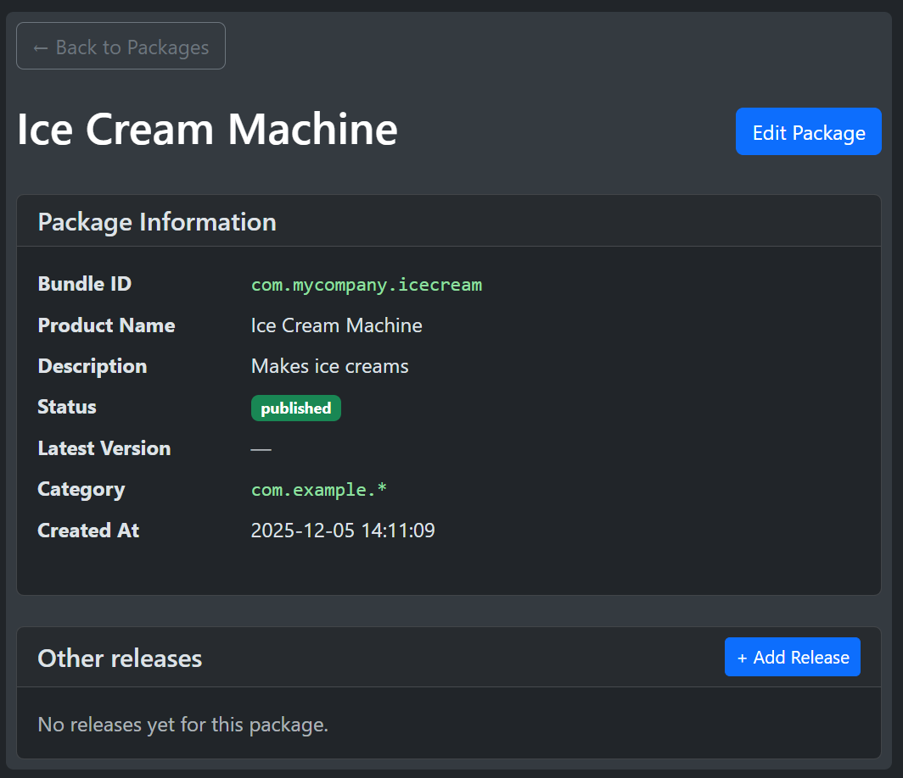
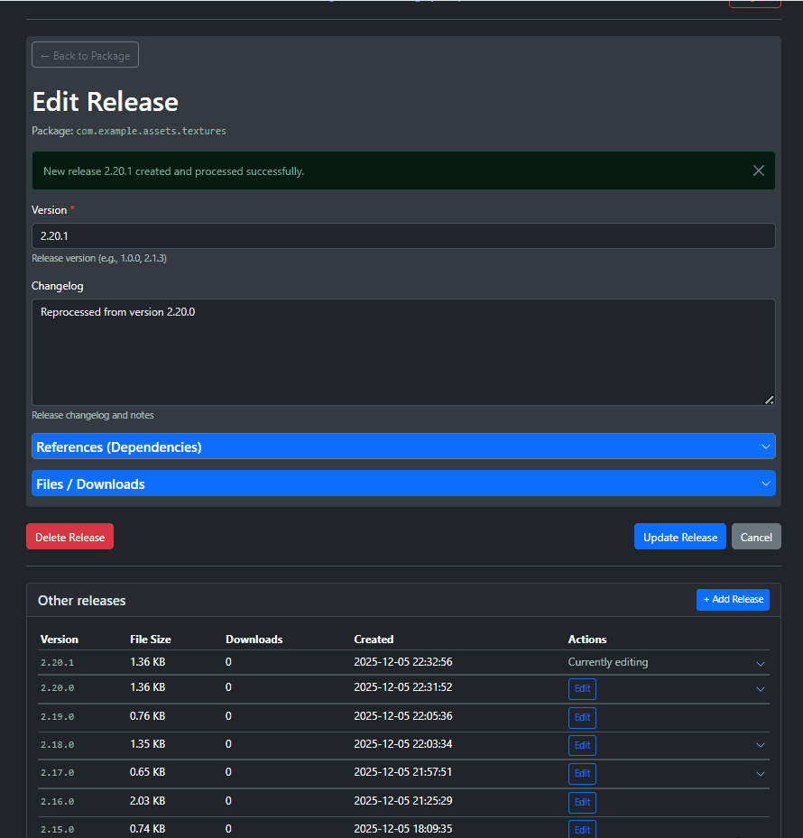
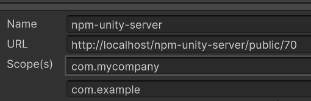

## NPM-UNITY-SERVER  - PHP only
---

 The whole thing is vibe-coded in a week. Useful for me.
 First time in Laravel. Last time I used PHP it was on version 4.

### Unity Package Manager

As we all know, Unity uses their own built in Package Manager. Wouldn't it be cool to be able to manage own flocks of snippets this way?

### Why use packages

- Packages enforce clearly defined assembly boundaries. Code in a package cannot reference other code, unless explicitly specified in dependencies.
- Users can update or downgrade a package.
- Packages are immutable, do not edit a release, release a patch version (sem ver).
- Dependencies can be installed automatically.
- Easier to maintain stable state across projects

### Features of this particular project.

- Can be placed on any long lasting PHP sever forever.
- Can be hosted locally, no need for python, node.js etc
-you just upload a zip file - the server repacks it to tarball with  creates package.json - it added with your tarball to a .tgz with re-created .meta files if needed *) - 
- Developer oriented
- Easy to use web editor, with features for declaring dependencies.
- Prepares package.json for you - you just need to upload a zip.
- Suitable for small teams

### Limitations:

- Not designed for large teams, as there is no real access control (Super user can create other users and add scopes and perform cleanup operations, but all users can publish all packages).
- Doesn't strictly follow the npm protocol - barely enough to pass by Unity.

### Back Story
[Keijiro](https://private-user-images.githubusercontent.com/343936/399951228-3e97a9b7-e157-49e9-8998-e32280513e9e.png?jwt=eyJ0eXAiOiJKV1QiLCJhbGciOiJIUzI1NiJ9.eyJpc3MiOiJnaXRodWIuY29tIiwiYXVkIjoicmF3LmdpdGh1YnVzZXJjb250ZW50LmNvbSIsImtleSI6ImtleTUiLCJleHAiOjE3NjQ5NDc5MjIsIm5iZiI6MTc2NDk0NzYyMiwicGF0aCI6Ii8zNDM5MzYvMzk5OTUxMjI4LTNlOTdhOWI3LWUxNTctNDllOS04OTk4LWUzMjI4MDUxM2U5ZS5wbmc_WC1BbXotQWxnb3JpdGhtPUFXUzQtSE1BQy1TSEEyNTYmWC1BbXotQ3JlZGVudGlhbD1BS0lBVkNPRFlMU0E1M1BRSzRaQSUyRjIwMjUxMjA1JTJGdXMtZWFzdC0xJTJGczMlMkZhd3M0X3JlcXVlc3QmWC1BbXotRGF0ZT0yMDI1MTIwNVQxNTEzNDJaJlgtQW16LUV4cGlyZXM9MzAwJlgtQW16LVNpZ25hdHVyZT04NTg0ZTkyYmM0NTkwYjM1NmIwMTkxMjI2YTEyYTc1M2UwMDA0MDc4NWQ2MGM1YTIzNjIyYzk1NjNiNWQ2YTkyJlgtQW16LVNpZ25lZEhlYWRlcnM9aG9zdCJ9.VZoqZsfCwy2HQWUs_xgOipuPOuW3nA7BUO6sr0UtGrU)
A while ago I discovered that Keijiro had good success, with publishing packages using NPM. https://gist.github.com/keijiro/f8c7e8ff29bfe63d86b888901b82644c But all that messing around with node.js, not everyone can live javascript, and not everyone has root access hosting.

Typically running a package server is quite involved. Full blown package server is not for the faint hearted. Most require node.js, python, and ideally shell access to the server. Some have it, some don't. PHP is widely popular. 

### How does unity PackageManager work?

NPM subset used by unity is very limited. Only really consists of making a request to:

`/public/-/v1/seach?text=com.myscope`

Server returns a list of package bundle names starting with the scope.
Unit then simply queries (for all received package bundle).

`/public/com.myscope.mypackage`

This endpoint returns some metadata about the package, used to draw UI in package manager. One of the fields contain a download link 

### What's going on with scopes?

It is assumed packages area public, so when you claim certain part of the namespace, unity will not allow two registers that claim control over the same namespace/scope.

This is just package space, namespace in the code are not required to follow.

Here, scopes with their display names are used in a hacky way as categories, injected as Author Name to metadata when json is produced. This is because unity draws nice foldout for each author, here I use it to group by scopes.

The server itself does not respect scopes (unless a flag in config is enabled), will return all packages for every query, but Unity is likely to filter out responses anways, so in general it seems a good practice to use bundle ids from a parent scope to avoid packages not displaying.

 

### Setup

I wanted to be able to host it on a basic PHP+MySQL combo, test locally, use locally, and be able to also have a publicly available database and endpoints. This would mean being able to cleanly install your packages without tampering with project structure.

I wanted to try and learn something new, decided to finally take a look at Laravel, given that we now have Cursor, that has proven to be an amazing ride.

There was a lot of exploring the unknown, installing composer and other tools that 

But now, in this form, I would _expect_ if you know how to use an ftp server, than the only challenge might be with the database setup, fortunately, AI has prepared that document in advance:

[In depth instruction on database setup](docs/DATABASE_SETUP.md)

Also, if you manage to see the site without errors, next steps are on how to log in as super-user, create admin users, create scopes/categories:

[Authentication setup (AI)](docs/AUTHENTICATION_SETUP.md)

### Hacky bits cases

Main server endpoint can accept an extra token - this has zero real world applications but helped me force Unity to discard any cache and query the server as it it was a brand new url, helps it refresh better.

`http://localhost/npm-unity-server/public/13/-/v1/search`

Uses "author " field in a hacky way - unity draws foldouts grouping packages coming from the same author, we can abuse that mechanism to have groups.

[I didn't ask for this AI summary of this project at early stage](docs/AI_SUMMARY.md)

### Security

No way to have a fully private server - by declaring a scope you ale claiming part of the namespace, so the server is always public (even if not listed in global register like keijro).
User passwords are soot of protected, but super user needs to edit an .env flag, to be able to log in and reset password for another user. This thing is meant for a few people max, permission management would have to be added - maybe later. 

*) not fully working yet, star this repo but its probably too early to clone