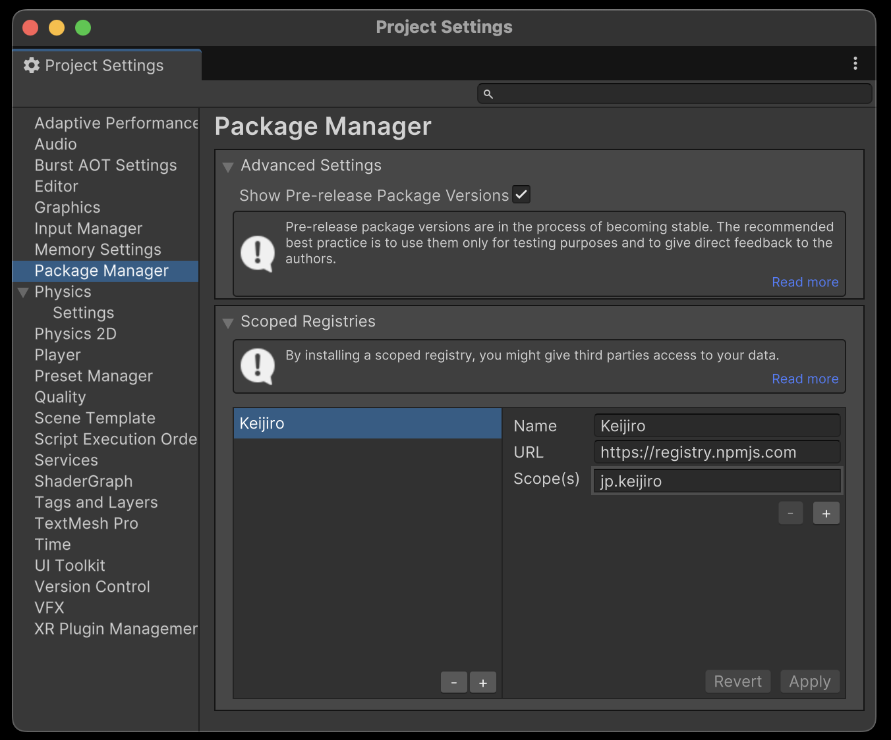

## NPM-UNITY-SERVER  - PHP only
---

 The whole thing is vibe-coded in a week. Useful for me.
 First time in Laravel. Last time I used PHP it was on version 4.

### Unity Package Manager

As we all know, Unity uses their own built in Package Manager. Wouldn't it be cool to be able to manage own flocks of snippets this way?


### Why use packages

- Packages enforce clearly defined assembly boundaries. Code in a package cannot reference other code, unless explicitly specified in dependencies.
- Users can update or downgrade a package.
- Packages are immutable, do not edit a release, release a patch version (sem ver).
- Dependencies can be installed automatically.
- Easier to maintain stable state across projects


### Features of this npm server:

- Can be placed on any old long-lasting PHP sever forever.
- Can be hosted locally, no need for python, node.js etc
-you just upload a zip file - the server repacks it to tarball with  creates package.json - it added with your tarball to a .tgz with re-created .meta files if needed 
- Developer oriented
- Easy to use web editor, with features for declaring dependencies.
- Prepares package.json for you - you just need to upload a zip.
- Suitable for small teams or solo developers.


### Setup


- Make sure you have a http server running. If you don't have a http server, you can use [XAMPP](https://www.apachefriends.org) or any other server with PHP >=8.2
- Download and unpack release to a folder visible to a http server (htdocs)
- If you want to use a 'proper' method, run `composer install` in the project folder. If not, unpack the provided `vendor.zip` folder. This is hacky but makes the project more 'self contained'
- Copy `.env.example` file to `.env`. 
- Edit the .env file, changing `ADMIN_ACCESS_ALLOWED = true`, change the default admin password.
- If you want to use MySQL database, edit the `.env` file
- You might also want to generate a new APP_KEY= (or just edit a few characters)
- Log in as a super user to create scopes / categories, and normal users.

If you run into trouble with your database, this document contains many details: 
[In depth instruction on database setup](docs/DATABASE_SETUP.md)

When logged in as super-user, you can also visit `/public/admin/databaseadmin` for dangerous and destructive features such as mysql dump/restore, nuking the database, seeding it with random packages and releases etc.

Read more on super users [Here (authentication setup instructions)](docs/AUTHENTICATION_SETUP.md)

Add your server to Unity Package Manager setup (in Project settings in modern versions of Unity) with the scopes added in the server.

### Back Story

I wanted to be able to host it on a basic PHP+MySQL combo, test locally, use locally, and be able to also have a publicly available database and endpoints. This would mean being able to cleanly install your packages without tampering with project structure.

I wanted to try and learn something new, decided to finally take a look at Laravel, given that we now have Cursor, that has proven to be an amazing ride.


[Keijiro](https://private-user-images.githubusercontent.com/343936/399951228-3e97a9b7-e157-49e9-8998-e32280513e9e.png)
A while ago I discovered that Keijiro had good success, with publishing packages using NPM. https://gist.github.com/keijiro/f8c7e8ff29bfe63d86b888901b82644c But all that messing around with node.js, not everyone can live javascript, and not everyone has root access hosting.




Typically running a package server is quite involved. Full blown package server is not for the faint hearted. Most require node.js, python, and ideally shell access to the server. Some have it, some don't. PHP is widely popular. This product has been made to be super user friendly, pretty much everything can be clicked-through the GUI.


### How does unity PackageManager work?

NPM subset used by unity is very limited. Only really consists of making a request to:

`/public/-/v1/seach?text=com.myscope`

Server returns a list of package bundle names starting with the scope.
Unit then simply queries (for all received package bundle).

`/public/com.myscope.mypackage`

This endpoint returns some metadata about the package, used to draw UI in package manager. One of the fields contain a download link.
While this looks very simple on paper, actually implementing it required jumping through some hoops.


### Managing Tarballs and package.json  

Unity requires (or at least prefers) few things to match in order to properly handle a package. Took me a long while to figure out the details needed to make it work.
- Package bundle id needs to be in the custom scope (reverse dns notation, if the scope is `com.abc.package`, it won't list `com.cde.packages`) declared for scoped registry.
- It needs to have a release (Unity won't list packages without releases).
- Version listed via search result should exist in the detailed package info.
- In the detailed package info, there should be a pointer to the last version
- In the version tagged latest, there should be a dist section with link to the tarball AND a SHA1 checksum (I spent at least two days debugging that - while you can omit many npm fields, the checksum is mandatory and unity will give cryptic error if you omit it )
``` 
"dist-tags": {
       "latest": "0.2.0"
 },
 "versions": {
    "0.2.0": {
        "dist": {
                "shasum": "f5eb29590c848c1e07b6c7d7c620e38215c9da63",
                "tarball": "http://localhost/npm-unity-server/public/com.example2.myexample.tgz"
                }
        }
    }
```
- Tarball (.tgz archive) should have a root 'package' folder, inside it there needs to be a `package.json` file, which should have the matching version and bundle id. This is also a place where we can declare dependencies. 
``` 
{
    "name": "com.example2.myexample",
    "version": "0.3.0",
    "displayName": "My Company Packages",
    "description": "example",
    "keywords": [
        "unity"
    ],
    "dependencies": [],
    "author": {
        "name": "Example Package Collection"
    }
}
``` 
In order to simplyfy the process, NPM-Unity-Server accepts a ZIP file as an input. 
- Uploaded file is stored in `/storage/app/private/incoming/com.myscope.mypackage/uploaded_filename_date.zip`
- It unpacks it.
- Adds a README.MD (if provided with the package).
- Aggregates a CHANGELOG.MD (from non-empty release changelogs).
- Adds .meta files for any files that don't have them, when it creates a meta file, it stores the uuid in the database, so they can be consistent (otherwise Unity will spam console with errors)
- It creates a package.json based on current version and other metadata.
- If no dependency override has been declared for this release, it tries to go back to any earlier version that might have declared dependencies, copies them and adds to package.json
- Finally packs the release artifact .tgz into `/storage/app/private/incoming_processed/com.myscope.mypackage-1.2.3-date.tgz`
- Release artifact is linked to the release - when queried for package details, it will generate downloadable urls for each release for which an artifact exists.

### Limitations:

- Not designed for large teams, as there is no real access control (Super user can create other users and add scopes and perform cleanup operations, but all users can publish all packages).
- Doesn't strictly follow the npm protocol - barely enough to pass by Unity.


### What's going on with scopes?

It is assumed packages area public, so when you claim certain part of the namespace, unity will not allow two registers that claim control over the same namespace/scope.

This is just package space, namespace in the code are not required to follow.

Here, scopes with their display names are used in a hacky way as categories, injected as Author Name to metadata when json is produced. This is because unity draws nice foldout for each author, here I use it to group by scopes.

The server itself does not respect scopes (unless a flag in config is enabled), will return all packages for every query, but Unity is likely to filter out responses anways, so in general it seems a good practice to use bundle ids from a parent scope to avoid packages not displaying.


<br>


If you make a mistake when creating a package, and it's bundle id is not contained within a specified scope, edit `app.php` and change `'enable_bundle_editing'=> true,` - with this setting you can edit the bundle id of existing packages. 

### Security

No way to have a fully private server - by declaring a scope you ale claiming part of the namespace, so the server is always public (even if not listed in global register like keijro).
User passwords are sort of of protected, but super user needs to edit an .env flag, to be able to log in and reset password for another user. This thing is meant for a few people max, permission management would have to be added - maybe later. 


### Hacky bits cases


Main server endpoint can accept an extra token - this has zero real world applications but helped me force Unity to discard any cache and query the server as it it was a brand new url, helps it refresh better.

`http://localhost/npm-unity-server/public/13/-/v1/search`


Uses "author " field in a hacky way - unity draws foldouts grouping packages coming from the same author, we can abuse that mechanism to have groups.


See also:

https://docs.unity3d.com/2019.1/Documentation/Manual/cus-layout.html

https://docs.unity3d.com/2019.1/Documentation/Manual/upm-manifestPkg.html
