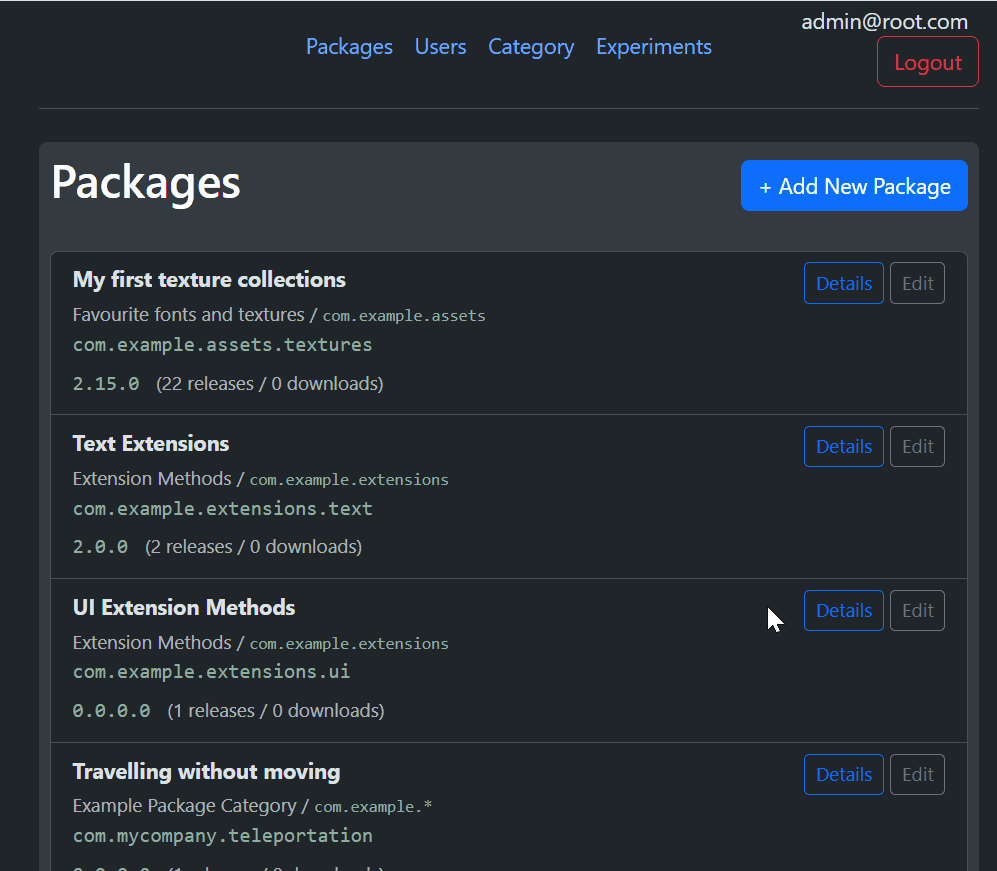
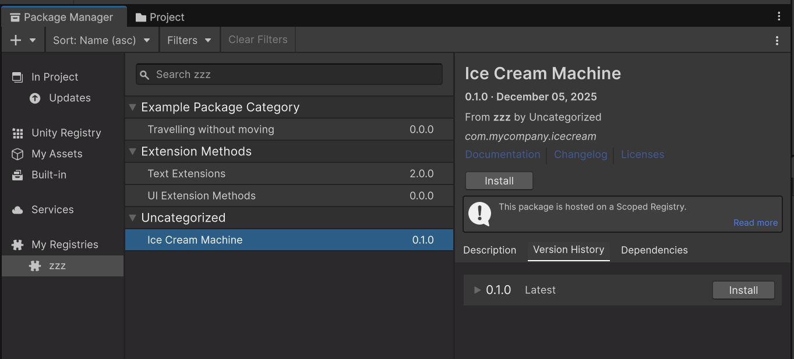

## NPM-UNITY-SERVER 
---
### Features:

- Only Php (MySQL optional)

- No need for python, node.js etc
- upload a zip fi
- Developer oriented
- Manage per-release dependencies.
- Agregate changelogs.
- Prepares package.json for you - you just need to upload a zip.
- Suitable for small teams

### Limitations:

- Not designed for large teams, as there is no real access control (Super user can create other users and add scopes and perform cleanup operations, but all users can publish all packages).
- Doesn't strictkly follow npm protocol - barely enough to pass by Unity.

### Why use packages

- Packages enforce clearly defined assembly boundaries. Code in a package cannot reference other code, unless explicitly specified in dependencies.
- Users can update or downgrade a package.
- Packages are immutable.
While Unity's Package Manager isn't the greatest, its better than nothing.

### Unity Package Manager

A while ago I discovered that Keijiro had good success, with publishing packages using NPM. https://gist.github.com/keijiro/f8c7e8ff29bfe63d86b888901b82644c But all that messing around with node.js, not everyone can live javascript, and not everyone has root access hosting.

Typically running a package server is quite involved. Full blown package server is not for the faint hearted. Most require node.js, python, and ideally shell access to the server. Some have it, some don't. PHP is widely popular. 

NPM subset used by unity is very limited. Only really consists of making a request to:
/-/v1/seach?text=com.myscope
Server returns a list of package bundle names starting with the scope.
Unit then simply queries (for all received package bundle).
/com.myscope.mypackage
This endpoint returns some metadata about the package, used to draw UI in package manager.

### What's going on with scopes.

I've wanted to try a way to manage my dependencies, in a way that would be less catastrophic than git sub-repos.

I wanted to be able to host it on a basic PHP+MySQL combo, test locally, use locally, and be able to also have a publicly available database and endpoints. This would mean being able to cleanly install your packages without messing with project structure.

I wanted to try and learn something new, decided to finaly take a look at Laravel, given that we now have Cursor.

I ended up vibe-coding a whole server with bells and whisles, over a couple ov days

### Setup

### Usage

http://localhost/npm-unity-server/public/45 you can add anything at the end of url you put in unity, each change makes unity forget previously cached packages and fetch a new list

Uses "author " field in a hacky way - unity draws foldouts grouping packages coming from the same author, we can abuse that mechanism to have groups.

### Hacky bits cases

[AI summary of this project](docs/AI_SUMMARY.md)
[Authentication setup (AI)](docs/AUTHENTICATION_SETUP.md)
[Unity package reference](docs/UNITY_PACKAGE_FORMAT.md)